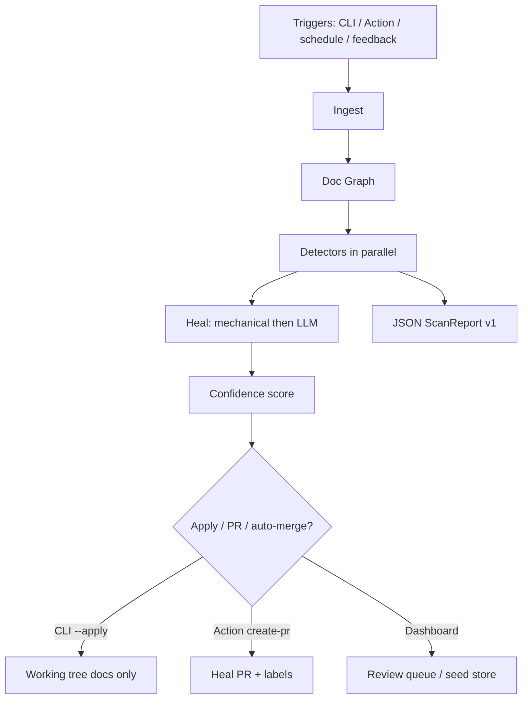

# Self-Healing Technical Documentation — Technical Tutorial

End-to-end guide to the **SHTD** monorepo: what it does, how packages fit together, how to run the CLI and dashboard, and how CI dogfoods the engine against planted fixtures.

Companion guides: [Architecture](./architecture.md) · [CLI](./cli.md) · [Action](./action.md) · [Dashboard](./dashboard.md) · [Getting started](./getting-started.md) · [Cheatsheet](./cheatsheet.md)

---

## Table of contents

1. [What SHTD is](#1-what-shtd-is)
2. [Monorepo map](#2-monorepo-map)
3. [Architecture and data flow](#3-architecture-and-data-flow)
4. [Doc Graph, findings, confidence, docs-only](#4-doc-graph-findings-confidence-docs-only)
5. [Configuration (`shtd.config.json`)](#5-configuration-shtdconfigjson)
6. [CLI](#6-cli)
7. [GitHub Action and workflows](#7-github-action-and-workflows)
8. [Dashboard (Ink & Signal)](#8-dashboard-ink--signal)
9. [Auto-merge and schedule](#9-auto-merge-and-schedule)
10. [Dogfooding and e2e](#10-dogfooding-and-e2e)
11. [Environment variables and secrets](#11-environment-variables-and-secrets)
12. [Hands-on walkthrough](#12-hands-on-walkthrough)
13. [Interpreting findings](#13-interpreting-findings)
14. [Where to go next](#14-where-to-go-next)

---

## 1. What SHTD is

**Problem:** Technical docs drift from code. Signatures change, links rot, OpenAPI examples go stale, and readers notice before authors do. Manual audits do not scale with CI.

**Product:** SHTD detects those failures, proposes **docs-only** patches, and surfaces them via CLI, GitHub Action (heal PR / PR comment), and a review dashboard. Reader “this page is wrong” reports become `kind: feedback` findings on the next scan.

**Surfaces:**

| Surface | Package | Role |
|---|---|---|
| Engine | `@shtd/core` | Ingest → Doc Graph → detect → heal → score |
| CLI | `@shtd/cli` | `shtd scan` / `heal` / `feedback add` |
| Action | `@shtd/action` | Composite Action wrapping the built CLI |
| Dashboard | `@shtd/web` | Runs, findings, review queue, embed widget |
| Types | `@shtd/shared` | Zod schemas (`HealFinding`, `ShtdConfig`, …) |
| DB | `@shtd/db` | Drizzle schema + demo seed data |

Findings do **not** fail the CLI by default (exit `0` when the engine completes). Use JSON reports and CI policy if you want to gate on counts.

---

## 2. Monorepo map

Workspace roots (`pnpm-workspace.yaml`): `apps/*`, `packages/*`.

```
apps/web/                 Next.js App Router dashboard (@shtd/web)
packages/
  shared/                 Zod types & ShtdConfigSchema
  core/                   Healing engine
  cli/                    shtd binary → dist/index.js
  action/                 Composite GitHub Action + scripts
  db/                     Drizzle schema, seed store helpers
docs/                     Product docs (dogfood target)
examples/sample-repo/     Planted fixture (see FIXTURES.md)
scripts/e2e-sample-repo.mjs
.github/workflows/
  shtd.yml                Dogfood scan/heal
  shtd-sample.yml         Scan sample-repo
```

| Path | Package name | Responsibility |
|---|---|---|
| `packages/shared` | `@shtd/shared` | Finding kinds, confidence, run triggers, config schema |
| `packages/core` | `@shtd/core` | `scan` / `heal` pipeline, detectors, patches, reports |
| `packages/cli` | `@shtd/cli` | Argument parsing, human/JSON output, exit codes |
| `packages/action` | `@shtd/action` | CI wrapper: report artifact, heal PR, PR comment |
| `packages/db` | `@shtd/db` | Postgres tables + `createSeedData()` for demo mode |
| `apps/web` | `@shtd/web` | Ink & Signal UI over seed or `DATABASE_URL` |

Build orchestration: Turborepo (`pnpm build` / `pnpm exec turbo build`). Node.js ≥ 20, package manager `pnpm@11`.

---

## 3. Architecture and data flow



### Pipeline stages (`@shtd/core`)

1. **Ingest** (`ingestRepo`) — Markdown/MDX pages (globs from config), OpenAPI specs, TypeScript symbols from source.
2. **Doc Graph** (`buildDocGraph`) — Nodes for pages, anchors, code symbols, OpenAPI ops/paths; edges `links_to` / `documents` / `references` / `embeds`.
3. **Detect** (`runDetectors`) — Parallel: drift, broken links/anchors/images, OpenAPI mismatch, tagged examples, local/API feedback.
4. **Heal** (`generatePatches`) — Mechanical renames/link fixes first (`MockProvider` still works without API keys); Anthropic for remaining rewrite-style findings when `ANTHROPIC_API_KEY` is set.
5. **Constrain** (`constrainPatchesToDocs`) — Drop anything outside `healPaths` / non-docs paths.
6. **Score** (`scoreFinding`) — high / medium / low for auto-merge and review UX.
7. **Emit** — `ScanReport` (version 1), optional disk apply, optional PR path (Action owns the full git/`gh` flow).

Triggers recorded on each run: `cli` | `github_action` | `schedule` | `feedback` | `manual` (`RunTriggerSchema` in `@shtd/shared`).

---

## 4. Doc Graph, findings, confidence, docs-only

### Doc Graph

Built from the repo index. Node kinds (`DocRefKind`): `page`, `anchor`, `code_symbol`, `openapi_operation`, `openapi_path`, `source_file`.

JSON reports include a graph summary: `{ nodeCount, edgeCount, pages }`.

### Finding kinds

From `FindingKindSchema` in `@shtd/shared`:

| Kind | Typical cause |
|---|---|
| `drift` | Doc signatures / names disagree with TS symbols |
| `broken_link` | Relative markdown link target missing |
| `broken_anchor` | `#slug` not present on target page |
| `broken_image` | Image path missing |
| `orphan_page` | Page not linked from elsewhere (medium confidence) |
| `openapi_mismatch` | Doc refs disagree with OpenAPI paths / operationIds / params |
| `example_failure` | Fence tagged `validate` fails parse/typecheck or wrong API |
| `feedback` | Reader report from CLI queue, widget, or `POST /api/feedback` |

### Confidence

Assigned in `packages/core/src/heal/score.ts`:

- **Mechanical** patches (links, whole-word renames) → **high**
- **LLM** rewrites → **medium** (or **low** if evidence is thin)
- Kind defaults: link/image/openapi/drift with a patch → high; `example_failure` / `orphan_page` → medium; `feedback` → low

### Docs-only constraint (v1)

Patches must match `healPaths` (default `docs/**`, `**/*.md`, `**/*.mdx`). Application source under `src/` is never written by heal. Paths with `..` or absolute roots are rejected. The Action commits only docs paths when opening a heal PR.

---

## 5. Configuration (`shtd.config.json`)

Loaded from the **scan target root** (`loadConfig`). Missing file → `DEFAULT_SHTD_CONFIG`. Invalid JSON/schema → Zod field errors and CLI exit **1**.

Schema: `ShtdConfigSchema` in `@shtd/shared`.

| Field | Default | Notes |
|---|---|---|
| `docs` | `docs/**/*.{md,mdx}`, `**/*.md` | Ingest globs |
| `openapi` | `[]` | Spec paths (YAML/JSON) |
| `ignore` | `node_modules`, `.git` | Skip globs |
| `healPaths` | `docs/**`, `**/*.md`, `**/*.mdx` | Patch allowlist |
| `autoMerge` | `enabled: false`, `minConfidence: high`, `requireGreenCi: true` | See [§9](#9-auto-merge-and-schedule) |
| `schedule` | `enabled: false`, `cron: "0 6 * * 1"` | Hint; Action YAML owns the timer |
| `prLabels` | `["self-heal"]` | Labels for heal PRs |
| `llm.provider` | `anthropic` | Falls back to mock without API key |

**Sample fixture config** (`examples/sample-repo/shtd.config.json`):

```json
{
  "docs": ["docs/**/*.{md,mdx}"],
  "openapi": ["openapi/openapi.yaml"],
  "ignore": ["**/node_modules/**"],
  "healPaths": ["docs/**"],
  "autoMerge": {
    "enabled": false,
    "minConfidence": "high",
    "requireGreenCi": true
  },
  "schedule": {
    "enabled": true,
    "cron": "0 6 * * 1",
    "description": "Weekly Monday scan"
  },
  "prLabels": ["self-heal"]
}
```

---

## 6. CLI

Package: `@shtd/cli`. Entry: `packages/cli/dist/index.js` (bin `shtd` → that file after build).

### Build

```bash
pnpm install
pnpm --filter @shtd/cli... build
```

### Commands

#### `shtd scan [path]`

Detect only. Human summary groups findings by kind. Exit `0` on success even when findings exist; exit `1` if `run.status === "failed"`.

```bash
node packages/cli/dist/index.js scan examples/sample-repo
node packages/cli/dist/index.js scan examples/sample-repo --json
node packages/cli/dist/index.js scan examples/sample-repo --json -o shtd-report.json
node packages/cli/dist/index.js scan --trigger schedule examples/sample-repo --json
```

#### `shtd heal [path]`

Detect + propose docs-only patches.

| Flag | Meaning |
|---|---|
| `--apply` | Write patches into the working tree |
| `--pr` | Attempt GitHub PR when a token is available (core defaults to dry-run unless `SHTD_PR_DRY_RUN=0`; Action owns the full PR flow) |
| `--json` / `-o` | Same report options as scan |
| `--trigger` | `cli` \| `github_action` \| `schedule` \| `feedback` \| `manual` |

```bash
node packages/cli/dist/index.js heal examples/sample-repo --json
node packages/cli/dist/index.js heal examples/sample-repo --apply --json -o heal-report.json
SHTD_CI_STATUS=success node packages/cli/dist/index.js heal --pr --trigger schedule examples/sample-repo
```

Without `ANTHROPIC_API_KEY`, mechanical fixes still run via `MockProvider`; LLM rewrites are skipped.

#### `shtd feedback add`

Appends to `.shtd/feedback.jsonl` under the repo path. Surfaced as `kind: feedback` on the next scan/heal. Optional `--api` POSTs to the dashboard.

```bash
node packages/cli/dist/index.js feedback add \
  --page docs/api.md \
  --note "Pagination section is wrong" \
  --quote "listWidgets({ page" \
  examples/sample-repo

node packages/cli/dist/index.js feedback add \
  --page docs/api.md \
  --note "Stale claim" \
  --api http://localhost:3000 \
  examples/sample-repo
```

#### `shtd help`

Usage, exit codes, cron examples.

### Exit codes

| Code | Meaning |
|---|---|
| `0` | Success — findings are **not** failures |
| `1` | Engine/run failure, invalid config, API feedback error |
| `2` | Usage error — unknown flag, bad `--trigger`, missing `--page`/`--note` |

### JSON report (`ScanReport` v1)

Produced by `toScanReport` in `@shtd/core`:

- `version: 1`, `tool: "shtd"`, `command`, `repoPath`, `generatedAt`
- `run` — status, stats (`findingsTotal`, `findingsByKind`, `findingsByConfidence`, `pagesScanned`, `durationMs`), `findings[]`
- optional `graph`, `patches`, `prUrl`, `prSkippedReason`, `autoMerge`, `configSummary`

Each finding includes `id`, `kind`, `path`, `evidence`, optional `patch`, `confidence`, `status`, `message`.

---

## 7. GitHub Action and workflows

Composite action: [`packages/action`](../packages/action) (`action.yml`). Checkout is **not** inside the action — the workflow must check out, install pnpm, and build `@shtd/cli...` first.

### Inputs / outputs (summary)

**Inputs:** `path`, `token`, `config`, `mode` (`scan`|`heal`), `create-pr`, `apply`, `report-path`, `comment-on-pr`, `working-directory`, `shtd-bin`, `pr-branch-prefix`

**Outputs:** `report-path`, `finding-count`, `patch-count`, `pr-url`, `status`

Full table: [`packages/action/README.md`](../packages/action/README.md).

### Workflows in this repo

| Workflow | File | Behavior |
|---|---|---|
| **shtd** | [`.github/workflows/shtd.yml`](../.github/workflows/shtd.yml) | Dogfood this monorepo on `pull_request`, `push` to main/master, weekly cron `0 6 * * 1`, `workflow_dispatch`. On PRs: comment, no heal PR. On push/schedule/dispatch: apply + create-pr (dispatch respects inputs). |
| **shtd-sample** | [`.github/workflows/shtd-sample.yml`](../.github/workflows/shtd-sample.yml) | `mode: scan` on `examples/sample-repo`; path filters for sample + core/cli/action. |

Permissions used: `contents: write`, `pull-requests: write`.

### Minimal consumer pattern

```yaml
permissions:
  contents: write
  pull-requests: write

jobs:
  shtd:
    runs-on: ubuntu-latest
    steps:
      - uses: actions/checkout@v4
        with:
          fetch-depth: 0
      - uses: pnpm/action-setup@v4
        with:
          version: 9
      - uses: actions/setup-node@v4
        with:
          node-version: 20
          cache: pnpm
      - run: pnpm install --frozen-lockfile
      - run: pnpm --filter @shtd/cli... build
      - id: shtd
        uses: ./packages/action
        with:
          token: ${{ secrets.GITHUB_TOKEN }}
          path: .
          mode: heal
          create-pr: ${{ github.event_name != 'pull_request' }}
          comment-on-pr: ${{ github.event_name == 'pull_request' }}
          report-path: shtd-report.json
      - uses: actions/upload-artifact@v4
        if: always()
        with:
          name: shtd-report
          path: ${{ steps.shtd.outputs.report-path }}
```

PR summary comments are upserted with marker `<!-- shtd-summary -->` so re-runs update one comment.

---

## 8. Dashboard (Ink & Signal)

App: `apps/web` (`@shtd/web`). Visual system: **Ink & Signal** — deep slate paper, teal signal accent (`--signal: #2ec4b6`), fonts Syne / Sora / JetBrains Mono (`globals.css` + Next font loaders).

### Run

```bash
pnpm --filter @shtd/web dev
# → http://localhost:3000
```

### Demo seed vs Postgres

| Mode | When | Data |
|---|---|---|
| **Demo** | No `DATABASE_URL` (and/or no GitHub OAuth) | In-memory `createSeedData()` from `@shtd/db`; seeded session so you can click through |
| **Postgres** | `DATABASE_URL` set | Drizzle schema in `@shtd/db` (organizations, users, repos, runs, findings, feedback, …) |

Copy `apps/web/.env.example` → `apps/web/.env.local` for OAuth + DB. Force demo auth with `FORCE_DEMO_AUTH=1` even if OAuth is configured.

### Routes

| Route | Purpose |
|---|---|
| `/` | Overview metrics + latest activity |
| `/repos` | Connected repositories |
| `/runs`, `/runs/[id]` | Scan/heal run list and detail |
| `/findings` | Findings across runs |
| `/review` | Accept / reject proposed patches |
| `/feedback` | Reader feedback inbox |
| `/settings` | Docs paths, auto-merge, schedule hints |

### API (selected)

| Method | Path | Notes |
|---|---|---|
| `GET`/`POST` | `/api/repos` | List / connect |
| `GET` | `/api/runs`, `/api/runs/[id]` | Runs |
| `GET`/`PATCH` | `/api/findings`, `/api/findings/[id]` | Findings + review |
| `POST` | `/api/feedback` | CORS “report inaccuracy” → `kind: feedback` |
| `GET` | `/api/auth/github`, `/api/auth/callback`, `/api/auth/logout` | OAuth |

### Embed widget

Served as `/embed.js` (`apps/web/public/embed.js`). Posts to `/api/feedback`.

```html
<script
  src="http://localhost:3000/embed.js"
  data-repo-id="repo_demo"
  data-page="docs/api.md"
  data-api="http://localhost:3000/api/feedback"
  defer
></script>
```

React equivalent: `FeedbackWidget` in `apps/web/src/components/feedback-widget.tsx`.

---

## 9. Auto-merge and schedule

### Auto-merge policy

Evaluated by `evaluateAutoMergePolicy` (`packages/core/src/automerge.ts`):

1. `autoMerge.enabled` must be `true`.
2. Every **patched** finding must meet the floor. Product lock: floor is never below **high** even if config is mis-set lower.
3. If `requireGreenCi` is true, CI must be green. Stub until Checks API: set `SHTD_CI_STATUS=success` (also accepts `1` / `true`, or `SHTD_CI_GREEN`).

Otherwise the engine prefers opening a PR for review (`needs-review` label path) rather than auto-merge.

```json
{
  "autoMerge": {
    "enabled": true,
    "minConfidence": "high",
    "requireGreenCi": true
  }
}
```

```bash
SHTD_CI_STATUS=success node packages/cli/dist/index.js heal --pr --trigger schedule examples/sample-repo
```

### Schedule

- Config field `schedule.cron` (5-field) is a **hint** for docs/dashboard/Action authors.
- The real timer in this repo is `.github/workflows/shtd.yml` → `schedule: - cron: "0 6 * * 1"`.
- Local usage (exit 0 unless the engine fails):

```bash
node packages/cli/dist/index.js scan --trigger schedule --json -o shtd-scan.json
```

---

## 10. Dogfooding and e2e

### Dogfood

This monorepo’s product docs live under `docs/`. CI runs the composite action via `shtd.yml` so SHTD scans/heals its own documentation.

### Sample fixture

`examples/sample-repo` **intentionally** plants drift, broken links, OpenAPI mismatches, and bad `validate` examples. **Do not fix those docs** — they are the regression oracle. Catalog: [`examples/sample-repo/FIXTURES.md`](../examples/sample-repo/FIXTURES.md).

### `pnpm test:e2e`

Runs `scripts/e2e-sample-repo.mjs`:

1. Builds `@shtd/cli...`
2. Scans `examples/sample-repo` to a temp JSON report
3. Asserts minimum finding counts by kind (soft floors from FIXTURES.md)

| Kind | Min |
|---|---|
| `drift` | 3 |
| `broken_link` | 3 |
| `broken_anchor` | 1 |
| `broken_image` | 1 |
| `openapi_mismatch` | 3 |
| `example_failure` | 2 |

Also requires non-zero `drift`, `broken_link`, `openapi_mismatch`. Extra detections do not fail; dropping below a floor does.

```bash
pnpm test:e2e
```

On failure, a debug report may be written to `shtd-e2e-last-report.json` at the repo root.

---

## 11. Environment variables and secrets

### Engine / CLI

| Variable | Purpose |
|---|---|
| `ANTHROPIC_API_KEY` | Enable Anthropic LLM patches; else `MockProvider` |
| `GITHUB_TOKEN` / `GH_TOKEN` | PR creation when `--pr` and dry-run off |
| `SHTD_PR_DRY_RUN` | Default dry-run for core PR path; set `0` to attempt `gh` |
| `SHTD_CI_STATUS` / `SHTD_CI_GREEN` | Stub green CI for auto-merge (`success` / `1` / `true`) |
| `SHTD_REPO_FULL_NAME` / `SHTD_REPO_ID` | Optional metadata on CLI feedback API posts |

### Dashboard (`apps/web/.env.local`)

| Variable | Purpose |
|---|---|
| `DATABASE_URL` | Postgres; omit for demo seed store |
| `GITHUB_CLIENT_ID` / `GITHUB_CLIENT_SECRET` | OAuth App |
| `GITHUB_CALLBACK_URL` | e.g. `http://localhost:3000/api/auth/callback` |
| `AUTH_SECRET` | Session cookie secret (≥ 32 chars) |
| `NEXT_PUBLIC_APP_URL` | Public site URL |
| `FORCE_DEMO_AUTH` | `1` = keep demo session even with OAuth configured |

Root [`.env.example`](../.env.example) points at the web template. Action workflows typically use `secrets.GITHUB_TOKEN` only.

---

## 12. Hands-on walkthrough

Assumes you are at the monorepo root. Commands are repo-relative (work the same conceptually on Windows paths).

### Step 1 — Install and build CLI

```bash
pnpm install
pnpm --filter @shtd/cli... build
```

### Step 2 — Scan the sample fixture

```bash
node packages/cli/dist/index.js scan examples/sample-repo
```

Expect groups such as `drift`, `broken_link`, `broken_anchor`, `broken_image`, `openapi_mismatch`, `example_failure`. Exit code should be `0`.

```bash
node packages/cli/dist/index.js scan examples/sample-repo --json -o shtd-report.json
```

### Step 3 — Heal (propose / optionally apply)

```bash
node packages/cli/dist/index.js heal examples/sample-repo --json -o heal-report.json
```

Inspect `patches` and per-finding `patch` / `confidence`. To write docs under `examples/sample-repo/docs` (**do not commit fixture “fixes”** if you use this for e2e):

```bash
node packages/cli/dist/index.js heal examples/sample-repo --apply
```

### Step 4 — Feedback → finding

```bash
node packages/cli/dist/index.js feedback add \
  --page docs/api.md \
  --note "Consistency claim is outdated" \
  --quote "eventually consistent" \
  examples/sample-repo

node packages/cli/dist/index.js scan --trigger feedback examples/sample-repo
```

Queue file: `examples/sample-repo/.shtd/feedback.jsonl`.

### Step 5 — Run the dashboard

```bash
pnpm --filter @shtd/web dev
```

Open http://localhost:3000. In demo mode you should see seeded repos/runs/findings and the Ink & Signal chrome. Try `/review`, `/findings`, `/feedback`, `/settings`.

### Step 6 — Regression check

```bash
pnpm test:e2e
```

### Step 7 — (Optional) Action dry-run locally

After building the CLI, see [`packages/action/README.md`](../packages/action/README.md) for env-driven `node packages/action/scripts/run-shtd.mjs` against `examples/sample-repo`.

---

## 13. Interpreting findings

When reading CLI or JSON output:

1. **Kind** — what class of failure (table in [§4](#4-doc-graph-findings-confidence-docs-only)).
2. **Path** — docs file the finding attaches to.
3. **Evidence** — `summary`, optional `expected` / `actual`, `sourcePath`, `docPath`.
4. **Confidence** — drives auto-merge eligibility and review priority.
5. **`[patch]`** in human output (or `patch` / report `patches`) — a proposed docs change exists.
6. **Auto-merge block reason** — on heal, printed when policy is evaluated.

Sample-repo mapping (from FIXTURES.md):

- `createWidget` / `removeWidget` / `listWidgets({ page })` in `docs/api.md` vs `src/widgets.ts` → **drift**
- Missing `./deployment.md`, `#advanced-filtering`, etc. → **broken_link** / **broken_anchor**
- Missing `./images/architecture.png` → **broken_image**
- `removeWidget` / `POST /v1/widgets/bulk` / `page` query in docs vs OpenAPI → **openapi_mismatch**
- `validate` fences with `removeWidget` or broken syntax → **example_failure**

---

## 14. Where to go next

| Goal | Doc |
|---|---|
| Short command reference | [cheatsheet.md](./cheatsheet.md) |
| Pipeline & kinds only | [architecture.md](./architecture.md) |
| CLI flags & exits | [cli.md](./cli.md) |
| Action inputs | [action.md](./action.md) + [packages/action/README.md](../packages/action/README.md) |
| UI routes & API | [dashboard.md](./dashboard.md) |
| Quick install path | [getting-started.md](./getting-started.md) |
| Planted failures | [examples/sample-repo/FIXTURES.md](../examples/sample-repo/FIXTURES.md) |

Engine APIs are re-exported from `@shtd/core` (`scan`, `heal`, `toScanReport`, detectors, `evaluateAutoMergePolicy`, …). Prefer those exports over inventing new call shapes.
